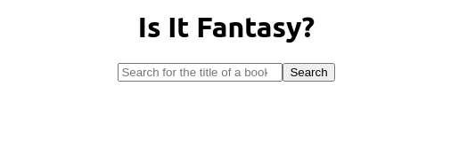

# Is It Fantasy?

A quick react app that lets you know _Is it fantasy?_

This app queries the [https://openlibrary.org/developers/api](Open Library API) with a book title. It then tells you if that book is fantasy or not.



## About

 I had a simple idea. An app that checks if a book is fantasy or not.

 It turns out, this is not such a simple idea. After searching through a few APIs, I couldn't find one easily that showed what genre a book is, as well as an image of the book cover.

 In the end I have used `Open Library API` to discover what is the genre of a book.

 In this app, a user simply types the title of a book into the search bar, and after the click to search they will be told if the book is fantasy or not.

## How To Run

Clone or fork this repository onto your computer. Make sure you are in the root directory and run the following to install:

```bash
npm i
```

To run the app, type:

```bash
npm start
```

This runs the app in development mode. It will automatically open the app, or you can view it in your browser under [http://localhost:3000](http://localhost:3000).

## Limitations

Currently this app only checks the first book that comes back from the API to see if it has the genre (or "subject", as it is called in the API) "fantasy". This means it often gets it wrong, as sometimes the first result doesn't have the "subject" section.


So it does work but not well, as a lot of the bigger and more popular fantasy novels return a "no". The logic of this app could be greatly improved. For instance, by checking more than one result rather than just the first result.

There is also only limited error checking.

Future iterations would allow you to select which book you meant, for example, and show an image of the book you searched for.

## How To Test

This repo uses the react testing library to test the app. To run the tests, use the following command:

```bash
npm test
```
